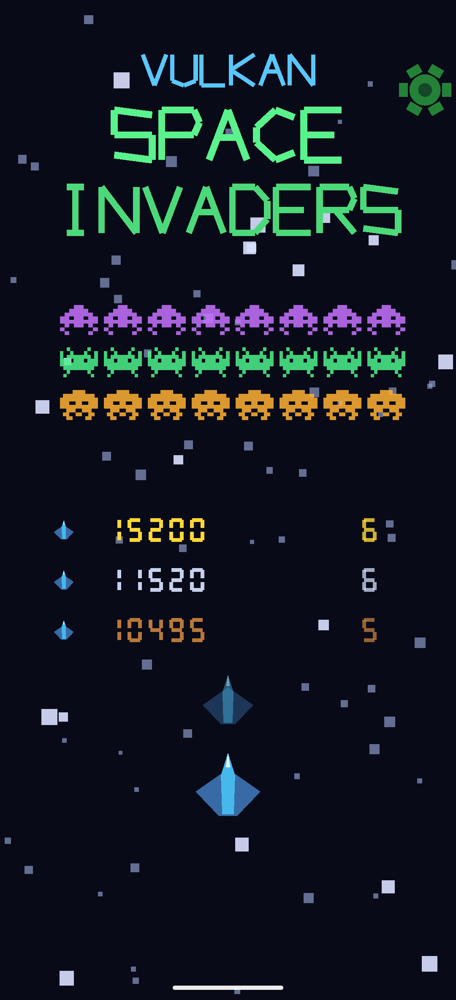
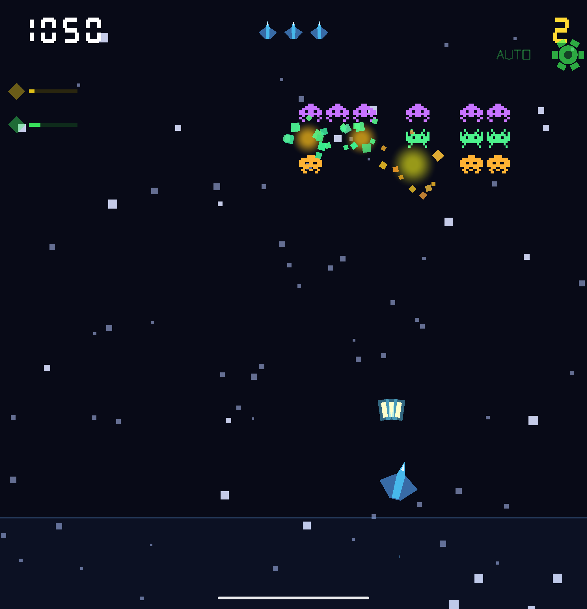
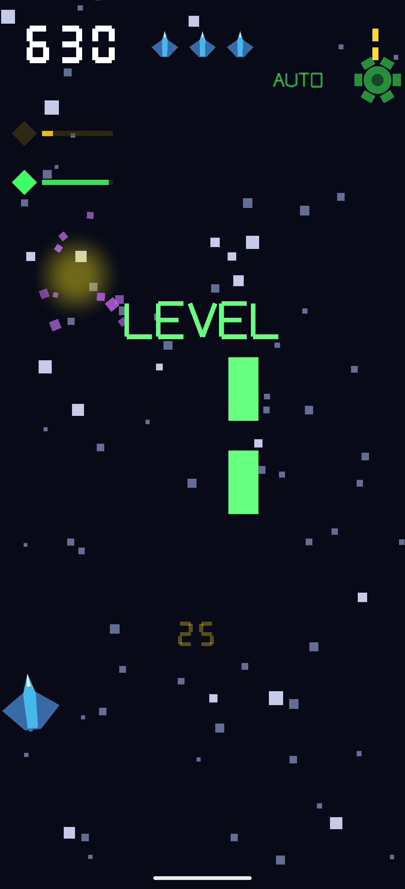
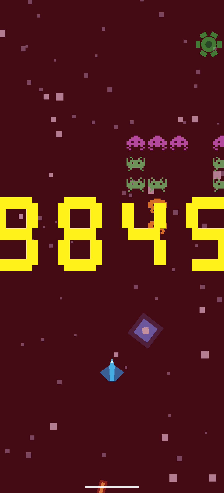
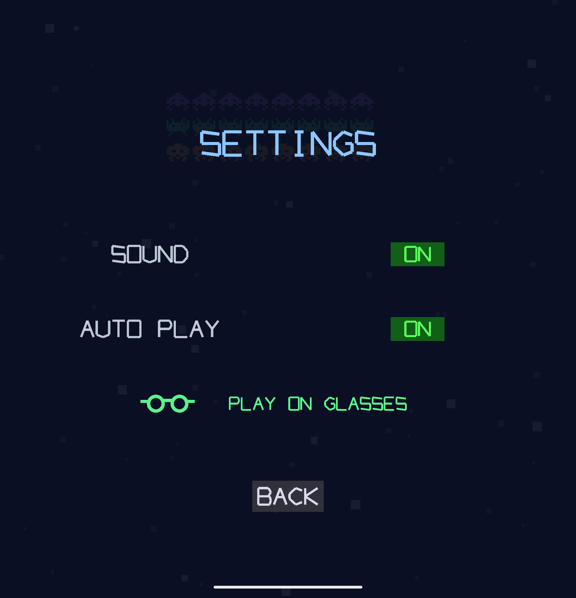
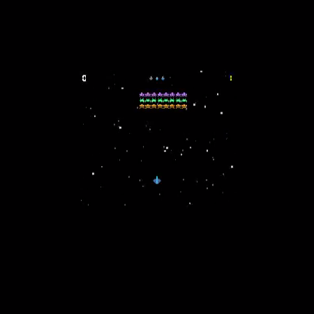

# Vulkan Space Invaders

A 2D **Space Invaders-like** game for **Android**, rendered with **Vulkan**.

Defend the bottom of the screen from marching waves of invaders across ten
increasingly difficult levels. Sibling project of
[VulkanAsteroids](https://github.com/jpcottin/VulkanAsteroids) — same
hand-written renderer, procedural audio engine and CI architecture, with a
brand-new game on top.

## Screenshots

Captured on a Pixel 10 Pro Fold emulator with **Auto Play** driving — the
layout adapts live to the cover and inner displays (fold/unfold rebuilds the
Vulkan swapchain and the world re-lays out from the new aspect ratio).

| Title (folded) | Auto Play in action (unfolded) |
|:---:|:---:|
|  |  |

| Level clear (folded) | Game over — new high score |
|:---:|:---:|
|  |  |

| Settings with paired AI Glasses | On the glasses: floating quarter-size window |
|:---:|:---:|
|  |  |

## Gameplay

| Control | Action |
|---------|--------|
| Hold the **strip below the ship** (bottom ~15% of screen) | The ship steers toward your finger **and auto-fires** while pressed |
| Tap the **gear icon** (top-right) | Open Settings from any screen |
| Tap anywhere on the title / game-over screen | Start / return to title |

- **Goal:** destroy every invader in the wave before it reaches your line.
- **Progression:** 10 levels. Level 1 fields 3 rows of 8 invaders; a row is
  added every other level (capped at 5 rows of 8). Each level marches faster,
  bombs more often, and starts lower.
- **Marching:** the wave sweeps side to side, drops down at each edge, and —
  as in the 1978 original — **speeds up as it thins**; the last survivor is
  ~3.5× faster than a full wave.
- **Row tiers:** 🟣 Squid (top) 30 pts · 🟢 Crab (middle) 20 pts ·
  🟠 Octopus (bottom) 10 pts — all ×level. Classic two-frame sprite animation
  synced to the march beat.
- **Bombs:** the bottom-most invader of a random column fires; bombs wobble as
  they fall and can be **shot down** in mid-air. Concurrent bombs and bomb
  speed scale with level.
- **Mystery saucer:** crosses the top of the screen with a warbling siren —
  100 pts ×level, with the bonus value flashed where it died.
- **Power-ups:** 8% drop chance on each kill: 🔵 Shield (absorbs one hit,
  lasts until hit) · 🟡 Rapid fire (halved cooldown, 8 s with HUD timer bar) ·
  🟢 Triple shot (a 3-laser volley — centre plus ±8° side lasers, 8 s).
  +25 pts ×level on pickup.
- **Lives:** 3. Lose one to a bomb hit or an invader collision (the invader is
  destroyed too); invulnerability blinks after each hit.
- **Invasion:** if the wave reaches the control strip, the invasion succeeds —
  **instant game over**, regardless of remaining lives.
- **Level clear:** +100 pts ×level.
- **Boss mothership at level 10:** a giant 16-HP saucer drifts sinusoidally
  across the top (health bar + "BOSS" label), lobbing bombs **aimed at you**,
  guarded by a two-row escort wave. Clearing the escort isn't enough — only
  destroying the mothership wins the game (+250 pts ×level).
- **HUD:** score (top-left) · lives as mini-ships (top-center) · level
  (top-right) · active power-ups with timer bars (left edge).
- **Ship banking:** the ship tilts ±20° into its direction of travel.
- **High scores:** top-5 leaderboard persisted locally; gold/silver/bronze
  podium on the title screen; gold pulsing score + rank medal on game over
  when a new record is set.
- **Screen shake** on ship hits; the HUD stays stable.
- **Haptic feedback** (50 ms vibration) on ship hit.
- **Sound:** all effects synthesised in real time — laser sweeps, explosion
  bursts, hit thuds, a rising pickup sparkle, the saucer siren, an ambient
  A-minor music bed, and the classic **four-note march bass** that accelerates
  with the wave.
- **Settings:** gear icon opens an overlay from any game state. Toggles:
  Sound on/off, Auto Play. Both persist across app restarts.
- **Auto Play:** AI autopilot — dodges incoming bombs (including the boss's
  angled shots, by predicted impact point), intercepts falling power-ups when
  nothing is shooting at it, lead-aims the boss, the saucer and the marching
  columns, and fires when aligned. It drives the exact same control path as a
  finger. Activate from Settings; the gear turns green with a pulsing "AUTO"
  label while active.
- **Foldable-aware:** fold or unfold mid-game and the layout re-adapts
  instantly — no stretching (see Tech).
- **Play on AI Glasses:** with Display Glasses paired, Settings shows a
  glasses row — *PLAY ON GLASSES* hands the whole game to the glasses'
  projected display, where the **touchbar** drives it: finger position steers
  the ship, contact auto-fires. The phone shows an "ON GLASSES" banner and
  throttles itself; *BACK TO PHONE* (in Settings) brings the game home. With
  nothing paired the row reads *NO GLASSES*.

## Tech

- **Pure native C++17** — Android
  [`NativeActivity`](https://developer.android.com/ndk/reference/group/native-activity)
  with `native_app_glue`; no Kotlin, no Compose, no Java (the only Kotlin file
  is the instrumented smoke test).
- **Hand-written Vulkan 1.0 2D renderer** — one graphics pipeline, one vertex
  buffer holding every shape, per-draw push constants (2×2 transform +
  translation + RGBA + fill style), FIFO present, two frames in flight.
- **Sprites as geometry, no textures** — the three invader types are classic
  11×8-ish **pixel-art bitmaps expanded into triangles at startup**, two march
  frames each; the saucer is a 16×7 bitmap. The player ship is the same
  three-layer delta-wing fighter as VulkanAsteroids (dark blue-gray swept
  wings, bright cyan fuselage, white nose spike), matching the app icon.
  Player lasers and alien bombs are two-layer bolts (glow + bright core);
  explosions are expanding glow rings (radial-falloff fragment style) plus 10
  spinning debris fragments. Two-speed parallax starfield (60 far + 20 near
  stars). Stroke vector font for text; 7-segment font for HUD numbers.
- **Procedural audio via [Oboe](https://github.com/google/oboe)** — an 8-voice
  synth on a low-latency mono float stream: pitch-swept laser, noise-burst
  explosions, hit thud, level-clear arpeggio, pickup sparkle, the four-note
  square-wave march loop (A2–G2–F2–E2), a warbling saucer siren with click-free
  envelope, and an 80 BPM ambient track (pad + bass + arpeggio). No audio files.
- **GLSL → SPIR-V** compiled at build time with the NDK's `glslc` (`-mfmt=c`)
  and `#include`d directly as C arrays — no runtime shader compiler, no assets.
- **Adaptive to foldables** — the whole layout derives from the surface aspect
  ratio each frame, and the renderer re-checks the surface extent every frame:
  when a fold/unfold resizes the window in place (the activity survives via
  `configChanges`), the swapchain is rebuilt at the new resolution instead of
  letting the compositor stretch the old one. The Compose-oriented adaptive
  layout tooling doesn't apply to a native Vulkan game — this is its NDK
  equivalent.
- **AI Glasses (Android XR projected)** — the glasses expose a secondary
  display (`ProjectionDisplay`, 30 Hz) owned by a virtual device. A ~70-line
  Kotlin bridge (`GlassesBridge.kt`, the repo's only production JVM code) uses
  `androidx.xr.projected` to observe pairing (`isProjectedDeviceConnected`)
  and to launch `GlassesGameActivity` — a second `NativeActivity` declared
  with `requiredDisplayCategory="xr_projected"` — onto that display. The
  native side calls the bridge over JNI, detects its role from the activity
  class, and switches the same game to touchbar controls with a pure-black
  clear (black = transparent on additive AR lenses). Phone and glasses
  instances coordinate through one process-wide session flag; the phone
  freezes and sleep-throttles while the glasses play so the projected
  display's encoder gets the GPU. The projected display is a 30 Hz panel, so
  the glasses instance uses a **low-latency swapchain** (minimal image count,
  one frame in flight, MAILBOX present when available, loop paced to ~60 fps)
  — app-side input latency drops from ~3 queued FIFO frames to about one
  refresh — and renders into a **centered quarter-size viewport** (a floating
  window on the lenses, 4× fewer pixels to rasterise; draw commands are
  NDC-based so nothing else changes). Emulator tips: input must target the
  projected display — `adb shell input -d <displayId> tap x y` — taps on the
  glasses AVD's own window are not forwarded, and the projection tears down
  when the glasses AVD sleeps (wake it to re-pair).
- **Runtime diagnostics via Logcat** — every launch logs a full Vulkan
  extension audit (`✓ USED` / `~ PRESENT` / `✗ ABSENT` / `? UNKNOWN`) for
  instance and device extensions, and a periodic FPS line (frames/s, average
  frame time, draw calls) every 5 s. Filter with `adb logcat -s SpaceInvaders`.
- `minSdk 24` (Vulkan requires API 24+), AGP 9, NDK r29, CMake 3.22.

## Build & run

```bash
# Build
./gradlew assembleDebug

# Install and launch with the Android CLI
android run --apks app/build/outputs/apk/debug/app-debug.apk

# Or with adb
adb install -r app/build/outputs/apk/debug/app-debug.apk
adb shell am start -n com.jpcottin.vulkanspaceinvaders/android.app.NativeActivity
```

Requires a device with a Vulkan driver (API 24+).

## Testing

### Native unit tests (Google Test)

103 tests covering the formation (rows per level, march direction, edge
reversal + descent, speed-up as the wave thins, side-margin containment),
invasion game-over (even through an active shield), alien-ship collision,
touch-strip ship control (steer, stop-on-finger, clamping, zone boundaries),
the huge-frame dt clamp, firing (auto-fire, cooldown, 3-laser cap, despawn),
per-tier kill scoring, bombs (drop cadence, concurrency cap, ship hits,
invulnerability window, shoot-down), the saucer (crossing, despawn, bonus
payout, suppression during the boss fight), power-ups (pickup, shield absorb,
shield persistence, rapid-fire cooldown + expiry, triple-shot volley count +
exact ±8° angles + expiry, uncollected fall-through), the level-10 boss (spawn +
HP, sine drift, aimed bombs, escort-doesn't-clear rule, kill-to-win payout, Auto
Play targeting), level progression (level-scaled clear bonus, in-flight-bomb
wipe on clear, level clamp at 10, boss handoff, game over on zero lives,
end-screen grace tap + title-return cleanup), process-death session restore
(bounds-checked resume of level/score/lives), the settings state machine (gear
tap, toggles, back button, persistence across instances), high-score
persistence (cross-instance disk merge, exact-duplicate skip, reload-from-disk
handoff, zero-score guard), the Auto Play AI (autonomous fire, bomb dodging,
power-up interception, saucer lead-aiming, wave completion), and the AI-Glasses
integration (touchbar steer/fire from anywhere, strip-mode isolation, no gear on
glasses, pure-black clear, settings row launch/inert/exit behaviour, phone
gameplay freeze during a glasses session). Run on a connected device or
emulator:

```bash
# ARM device (default)
./gradlew runNativeTests

# x86_64 emulator
./gradlew runNativeTests -PtestAbi=x86_64

# Several devices connected? Pin one:
ANDROID_SERIAL=emulator-5556 ./gradlew runNativeTests
```

### Instrumented smoke test

Launches the `NativeActivity` on a connected device, waits 4 s for Vulkan to
initialise, asserts the activity is still `RESUMED`, and captures a
screenshot:

```bash
./gradlew connectedAndroidTest
```

## CI/CD

Three GitHub Actions jobs run on every push and pull request to `main`:

| Job | What it does | Artifacts |
|-----|-------------|-----------|
| **Build APK** | Compiles the debug APK | `debug-apk` |
| **Native Tests** | Runs the 103 Google Test cases on x86\_64 emulators (API 34 + API 36) | — |
| **Smoke Test** | Runs the Android instrumented test on x86\_64 emulators and captures an in-game screenshot via `UiAutomation`. The test asserts the activity is RESUMED **and** that the renderer logged `Swapchain ready`, so a dead Vulkan path fails loudly. Blocking on API 34 + 36; non-blocking preview legs on API 37.0 (`google_apis_ps16k`, 16 KB pages) across the swiftshader / lavapipe / auto GPU backends | `smoke-screenshot-api*`, `smoke-test-results-api*`, `smoke-logcat-api*` (suffixed per leg) |

## License

[Apache License 2.0](LICENSE).
